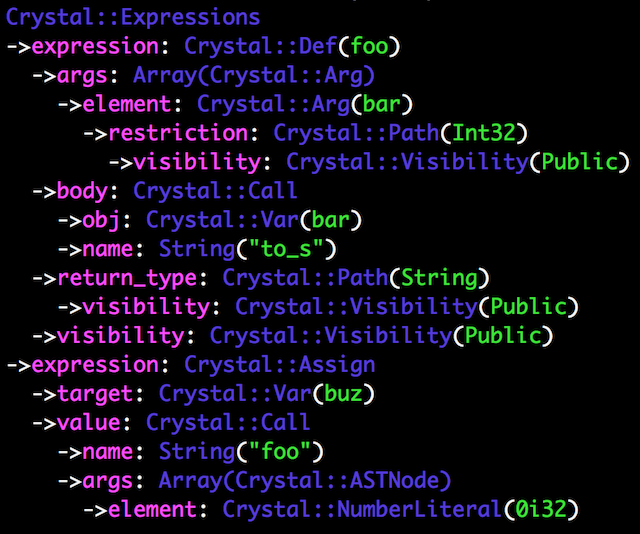

# AST Viewer for Crysal

Visualize the AST structure from ASTNode object, source file, or source code string.

The target compiler version is **0.27.0**.

## Installation

Add this to your application's `shard.yml`:

```yaml
dependencies:
  ast_viewer:
    github: arcage/ast_viewer.cr
```

## Usage

```crystal
require "ast_viewer"

# From ASTNode object
viewer = ASTViewer.from_node(node_object)

# From source file
viewer = ASTViewer.from_file("source_file.cr")

# From source code string
source_code = <<-SRC
def foo(bar : Int32) : String
  bar.to_s
end

buz = foo(0)
SRC
viewer = ASTViewer.from_source(source_code)

puts viewer
```

Result exapmle:



If you doesn't want to colorize the output, set `colorize` property to `false`:

```crystal
viewer.colorize = false
```

When the AST is parsed from the source code that has **syntax** error, the error message simillar to the compile time error will be displaied.

Result example 2(`a = [1, 2, 3` is given): 

```prain
Syntax error in :1: expecting token ']', not 'EOF'

a = [1, 2, 3
            ^
```

## Notice

This shard will parse source code on the **syntax** level only, not the semantic level.

- Any AST transformations are not applied. (`require` file, `unless` to `if` conversion ...)
- Semantic errors are not checked. (method existence, type mismatch ...)

## Contributors

- [arcage](https://github.com/arcgae) ʕ·ᴥ·ʔAKJ - creator, maintainer
